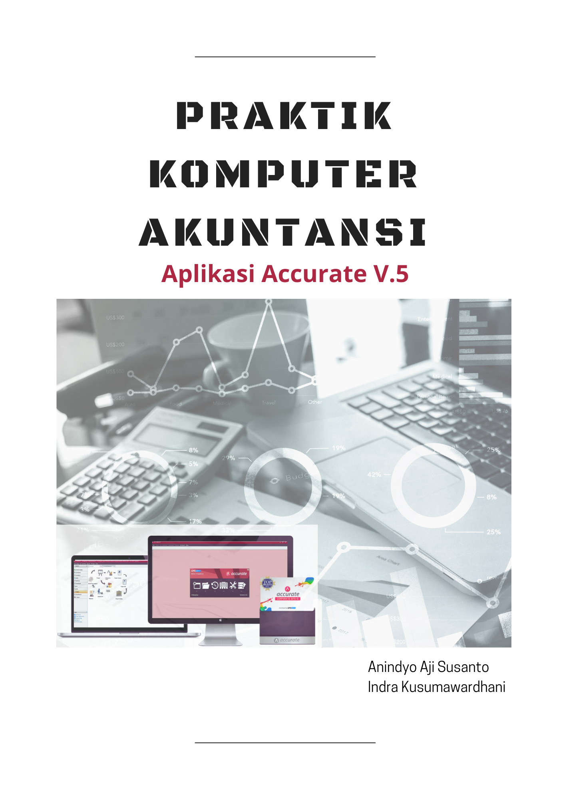

# Pengantar

<a href="https://amzn.to/2LCthli"></a>

Akuntansi Komputerisasian merupakan topik yang telah lama menjadi bagian dalam kurikulum pendidikan akuntansi. Perkembangan teknologi informasi yang sangat cepat jelas merupakan pendorong utama penggunaan berbagai produk teknologi informasi untuk menyederhanakan tugas-tugas manusia secara umum, termasuk dalam aktivitas bisnis. Di antara berbagai aktivitas yang sangat intensif memanfaatkan penggunaan teknologi informasi adalah aktivitas pelaporan keuangan yang menjadi fokus kajian ilmu akuntansi. Hingga buku ini sampai di tangan pembaca, topik akuntansi komputerisasian barangkali telah menjadi salah satu topik penting dalam kajian akuntansi selama kurun masa yang hampir sama dengan masa penggunaan aplikasi komputer untuk menunjang aktivitas administratif organisasi dan bisnis.

## Aplikasi Akuntansi Komputerisasian

Penggunaan perangkat lunak atau aplikasi komputer untuk menjalankan proses akuntansi dalam menghasilkan laporan keuangan telah mengalami perkembangan yang pesat seiring dengan perkembangan teknologi informasi dari masa ke masa. Berawal dari penggunaan komputer sebagai media pengolah informasi dengan sistem operasi komputer sederhana seperti MS-DOS di era 1980-an, hingga hari ini bermunculan teknologi-teknologi seperti *Enterprise Resource Planning*, mesin pembelajar atau kecerdasan buatan. Setiap perkembangan teknologi informasi sedikit banyak akan mempengaruhi praktik bisnis dan praktik akuntansi. Namun demikian, buku ini tidak akan membahas seluruh teknologi yang digunakan untuk menjalankan proses akuntansi. Buku ini hanya akan membahas penggunaan aplikasi akuntansi komputerisasian yang cukup populer *Accurate Accounting*.

## Aplikasi *Accurate Accounting*

*Accurate Accounting* adalah salah satu software akuntansi yang digunakan untuk mempermudah pengelolaan data keuangan untuk memudahkan penyusunan laporan keuangan. Aplikasi akuntansi ini cukup populer dan beberapa kali meraih prestasi sebagai pengembang aplikasi akuntansi terbaik dengan klaim cakupan pengguna terbanyak di Indonesia. *Accurate Accounting* memiliki beberapa versi yaitu:

A.  *Accurate Standar Edition* (SE)
B.  *Accurate Deluxe Edition* (DE)
C.  *Accurate Enterprise Edition* (EE)

Di antara 3 versi tersebut, *Accurate Enterprise Edition* merupakan versi terlengkap yang mencakup semua fasilitas dari 2 versi yang lain ditambah beberapa fungsi bagi akuntansi perusahaan manufaktur. Di samping itu, *Accurate Accounting* memiliki beberapa fitur yang menjadi keunggulan aplikasi ini antara lain:

1.  *User Friendly* yang membuat pengguna aplikasi ini tidak terlalu kesulitan untuk mempelajari dan menggunakan aplikasi ini sesuai kebutuhan.
2.  Tingkat keamanan yang memadai dengan adanya pembatasan akses pengguna menggunakan beberapa tingkatan (Akses untuk membuat/*Create*, akses untuk mengubah/*Edit* dan akses untuk melaporkan/*report*)
3.  Kemampuan integrasi dengan beberapa jenis file aplikasi populer yang lazim digunakan untuk akuntansi komputerisasian seperti Microsoft Excel, file pdf, txt, rtf dsb.
4.  Disesuaikan dengan standar akuntansi keuangan di Indonesia
5.  Pilihan bahasa yang bersifat *bilingual*
6.  Dapat dihubungkan dengan ketentuan perpajakan di Indonesia

Beberapa keunggulan tersebut membuat aplikasi ini cukup populer dan banyak digunakan terutama di kalangan UMKM bagi kepentingan pelaporan keuangan. Buku ini membahas penggunaan aplikasi Accurate V.5 yang merupakan pembaruan dari versi sebelumnya dengan beberapa fitur baru seperti: Menu Navigasi, Tampilan *Multilayer*, Fitur *Quick Setup* (Persiapan Singkat), Modul *Cash & Bank*, Modul Pembelian dan Penjualan, Modul *Fixed Asset*, fitur transaksi berulang (*reccuring*), fitur nomor seri barang (*Serial Number Control*), fitur perhitungan kurs valuta asing dan fitur kustomisasi laporan. Detil manfaat penggunaan fitur utama aplikasi ini akan dibahas lebih lanjut pada bab selanjutnya menggunakan contoh-contoh kasus.

```{r include=FALSE}
# automatically create a bib database for R packages
knitr::write_bib(c(
  .packages(), 'bookdown', 'knitr', 'rmarkdown'
), 'packages.bib')
```
